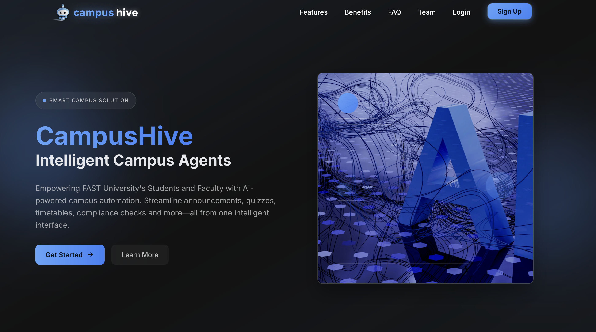
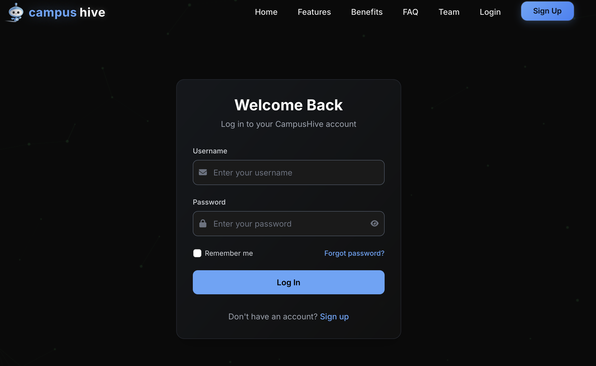
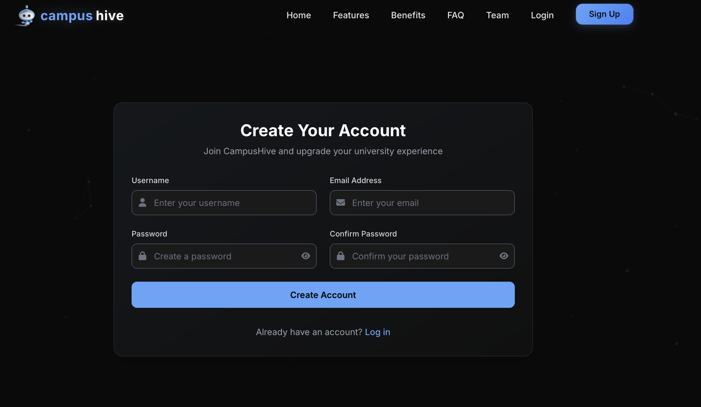
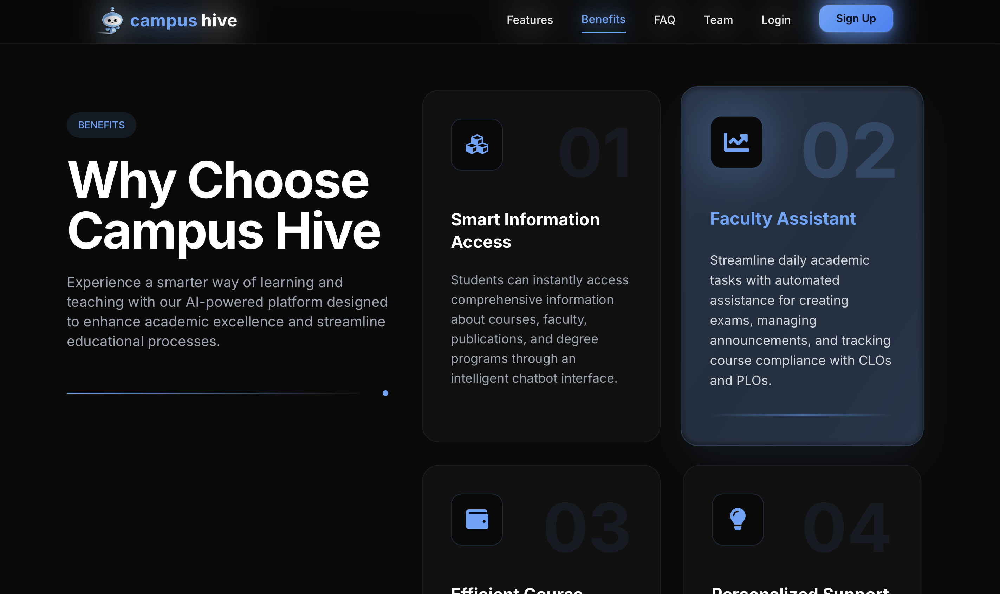
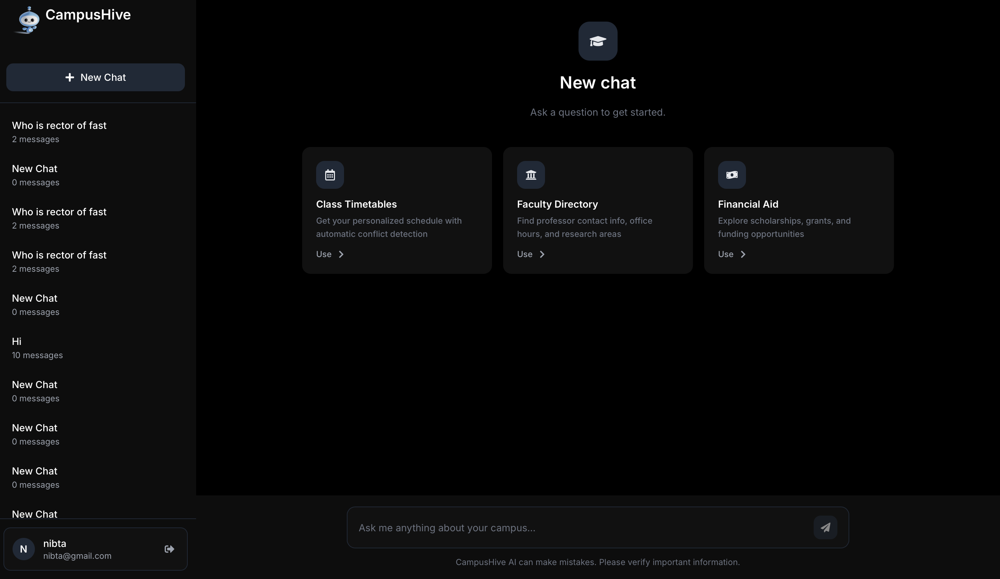
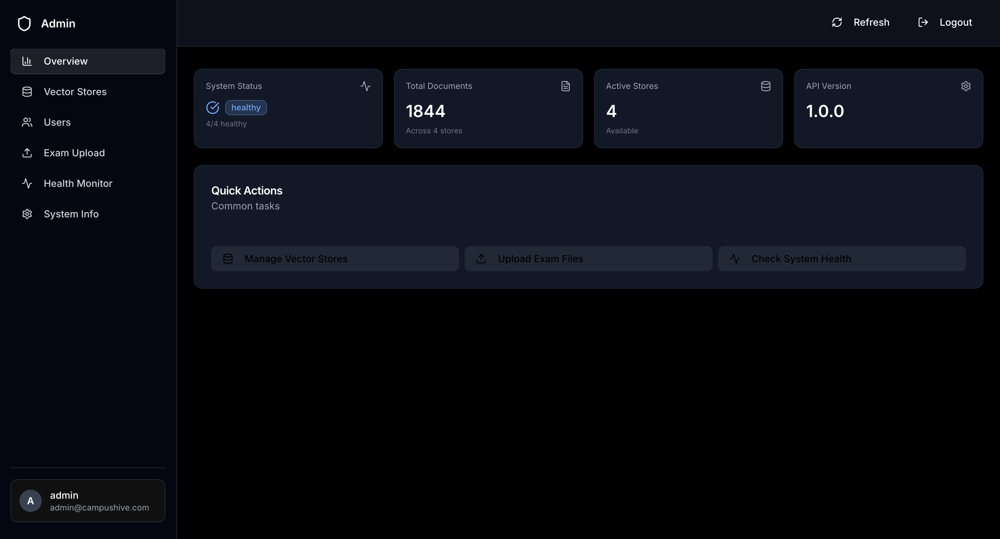
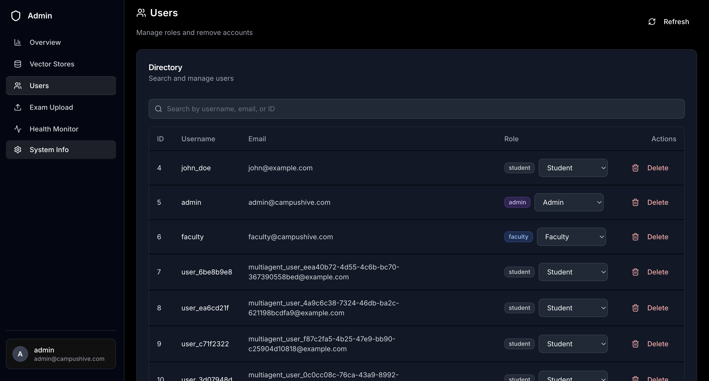
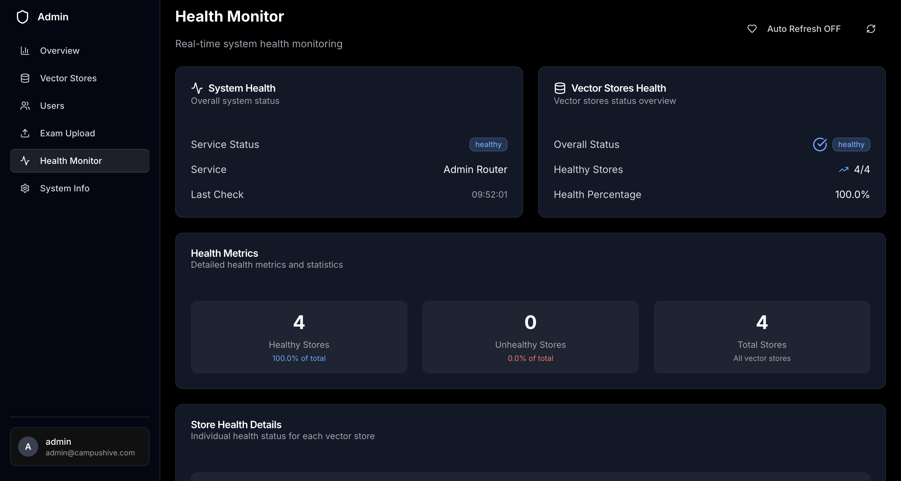

# 🎓 CampusHive Frontend

<div align="center">
  
  
  **An Intelligent AI-Powered Academic Assistant Platform**
  
  [](https://reactjs.org/)
  [](https://vitejs.dev/)
  [](https://tailwindcss.com/)
  [](https://www.typescriptlang.org/)
</div>

## 🌟 Overview

CampusHive Frontend is a modern, responsive web application built with React and Vite that provides an intelligent AI-powered academic assistant platform. It features a sophisticated chatbot interface, comprehensive admin dashboard, and beautiful user experience designed for students, faculty, and administrators.

## ✨ Key Features

### 🤖 **Intelligent Chatbot Interface**
- **Multi-Agent AI System**: Advanced conversational AI with specialized agents for different academic domains
- **Session Management**: Persistent chat sessions with history and context preservation
- **Real-time Communication**: Instant responses with streaming capabilities
- **Markdown Support**: Rich text rendering with code blocks, tables, and formatting
- **Quick Actions**: Pre-defined action buttons for common academic queries

### 👨‍💼 **Admin Dashboard**
- **System Monitoring**: Real-time health monitoring and system statistics
- **User Management**: Comprehensive user administration and role management
- **Vector Store Management**: AI knowledge base administration and maintenance
- **Exam Upload System**: Bulk exam document processing and management
- **System Information**: Detailed system metrics and performance monitoring

### 🎨 **Modern UI/UX**
- **Responsive Design**: Mobile-first approach with seamless cross-device experience
- **Dark Theme**: Beautiful dark mode with custom color schemes
- **Interactive Components**: Smooth animations and transitions using Framer Motion
- **Accessibility**: WCAG compliant with keyboard navigation and screen reader support
- **Component Library**: Custom UI components built with Radix UI and Tailwind CSS

### 🔐 **Authentication & Security**
- **JWT Authentication**: Secure token-based authentication system
- **Role-Based Access Control**: Different access levels for students, faculty, and admins
- **Protected Routes**: Secure navigation with authentication guards
- **Session Management**: Automatic token refresh and logout handling

## 🖼️ Screenshots

### Landing Page & Authentication
<div align="center">
  
  <p><em>Beautiful hero section with modern design and interactive elements</em></p>
</div>

<div align="center">
  
  <p><em>Secure login interface with elegant design</em></p>
</div>

<div align="center">
  
  <p><em>User registration with form validation and security</em></p>
</div>

<div align="center">
  
  <p><em>Feature showcase highlighting platform benefits</em></p>
</div>

### Chatbot Interface
<div align="center">
  
  <p><em>Intelligent chatbot with session management and quick actions</em></p>
</div>

### Admin Dashboard
<div align="center">
  
  <p><em>Comprehensive admin dashboard with system overview and navigation</em></p>
</div>

<div align="center">
  
  <p><em>User management interface with role-based controls and administration</em></p>
</div>

<div align="center">
  
  <p><em>Real-time system health monitoring and performance diagnostics</em></p>
</div>

## 🛠️ Technology Stack

### **Frontend Framework**
- **React 18.3.1** - Modern React with hooks and concurrent features
- **Vite 5.4.2** - Lightning-fast build tool and development server
- **React Router DOM 6.22.1** - Client-side routing and navigation

### **UI & Styling**
- **Tailwind CSS 3.4.1** - Utility-first CSS framework
- **Radix UI** - Accessible, unstyled UI components
- **Framer Motion 11.18.2** - Production-ready motion library
- **Lucide React** - Beautiful, customizable icons
- **React Icons** - Popular icon libraries

### **Form Handling & Validation**
- **React Hook Form 7.58.0** - Performant forms with easy validation
- **Zod 3.25.64** - TypeScript-first schema validation
- **@hookform/resolvers** - Validation resolvers for React Hook Form

### **Content & Markdown**
- **React Markdown 10.1.0** - Markdown component for React
- **Remark GFM** - GitHub Flavored Markdown support

### **Development Tools**
- **ESLint** - Code linting and quality assurance
- **TypeScript** - Static type checking
- **PostCSS** - CSS processing and optimization
- **Autoprefixer** - CSS vendor prefixing

## 🚀 Quick Start

### Prerequisites
- **Node.js** (v18 or higher)
- **npm** or **yarn**
- **CampusHive Backend** running on `http://localhost:8000`

### Installation

1. **Clone the repository**
   ```bash
   git clone https://github.com/yourusername/campus-hive.git
   cd campus-hive/CampusHive-Frontend
   ```

2. **Install dependencies**
   ```bash
   npm install
   # or
   yarn install
   ```

3. **Set up environment variables**
   ```bash
   cp .env.example .env
   ```
   
   Configure your environment variables:
   ```env
   VITE_API_BASE_URL=http://localhost:8000
   VITE_APP_NAME=CampusHive
   ```

4. **Start the development server**
   ```bash
   npm run dev
   # or
   yarn dev
   ```

5. **Open your browser**
   Navigate to `http://localhost:5173` to view the application.

## 📁 Project Structure

```
CampusHive-Frontend/
├── public/                 # Static assets
├── src/
│   ├── assets/            # Images, icons, and static files
│   ├── components/        # Reusable React components
│   │   ├── admin/         # Admin-specific components
│   │   ├── blocks/        # UI block components
│   │   ├── hooks/         # Custom React hooks
│   │   └── ui/            # Base UI components
│   ├── contexts/          # React context providers
│   ├── lib/               # Utility libraries and API client
│   ├── pages/             # Page components
│   ├── utils/             # Helper functions
│   ├── App.jsx            # Main application component
│   └── main.jsx           # Application entry point
├── screenshots/           # Application screenshots
├── docs/                  # Documentation
├── package.json           # Dependencies and scripts
├── tailwind.config.cjs    # Tailwind CSS configuration
├── vite.config.js         # Vite configuration
└── README.md              # This file
```

## 🎯 Available Scripts

```bash
# Development
npm run dev          # Start development server
npm run build        # Build for production
npm run preview      # Preview production build
npm run lint         # Run ESLint

# Production
npm run build        # Create optimized production build
```

## 🔧 Configuration

### Environment Variables

Create a `.env` file in the root directory:

```env
# API Configuration
VITE_API_BASE_URL=http://localhost:8000
VITE_APP_NAME=CampusHive
VITE_APP_VERSION=1.0.0

# Feature Flags
VITE_ENABLE_ANALYTICS=false
VITE_ENABLE_DEBUG_MODE=false
```

### Tailwind CSS Configuration

The project uses a custom Tailwind configuration with:
- Custom color palette
- Extended spacing and typography
- Animation utilities
- Component-specific styles

## 🎨 UI Components

### **Core Components**
- **Navbar** - Responsive navigation with authentication
- **Hero** - Landing page hero section
- **Chatbot** - AI conversation interface
- **AdminDashboard** - Administrative control panel
- **ProtectedRoute** - Authentication guards

### **Admin Components**
- **UserManagement** - User administration
- **VectorStoresManagement** - AI knowledge base management
- **ExamUpload** - Document processing system
- **SystemInfo** - System monitoring
- **HealthMonitor** - Real-time health checks

### **UI Components**
- **Button** - Customizable button component
- **Card** - Content container component
- **Dialog** - Modal and overlay components
- **Input** - Form input components
- **Table** - Data display component

## 🔐 Authentication Flow

1. **User Registration/Login** - Secure authentication with JWT tokens
2. **Role-Based Access** - Different interfaces for students, faculty, and admins
3. **Protected Routes** - Automatic redirection for unauthorized access
4. **Session Management** - Persistent login state with automatic refresh

## 📱 Responsive Design

The application is fully responsive with breakpoints:
- **Mobile**: < 768px
- **Tablet**: 768px - 1024px
- **Desktop**: > 1024px

## 🚀 Deployment

### Build for Production

```bash
npm run build
```

This creates an optimized build in the `dist/` directory.

### Deploy to Vercel

```bash
# Install Vercel CLI
npm i -g vercel

# Deploy
vercel --prod
```

### Deploy to Netlify

```bash
# Build the project
npm run build

# Deploy dist/ folder to Netlify
```

## 🤝 Contributing

We welcome contributions! Please follow these steps:

1. **Fork the repository**
2. **Create a feature branch**
   ```bash
   git checkout -b feature/amazing-feature
   ```
3. **Commit your changes**
   ```bash
   git commit -m 'Add amazing feature'
   ```
4. **Push to the branch**
   ```bash
   git push origin feature/amazing-feature
   ```
5. **Open a Pull Request**

### Development Guidelines

- Follow the existing code style and conventions
- Write meaningful commit messages
- Add tests for new features
- Update documentation as needed
- Ensure all tests pass before submitting

## 📚 Documentation

- [API Documentation](../docs/api/README.md)
- [Component Documentation](./docs/components.md)
- [Deployment Guide](./docs/deployment.md)
- [Contributing Guidelines](./docs/contributing.md)

## 🐛 Troubleshooting

### Common Issues

**Build Errors**
```bash
# Clear node_modules and reinstall
rm -rf node_modules package-lock.json
npm install
```

**API Connection Issues**
- Verify backend server is running on `http://localhost:8000`
- Check environment variables in `.env` file
- Ensure CORS is properly configured

**Authentication Issues**
- Clear browser storage and cookies
- Verify JWT token configuration
- Check user role permissions

## 📄 License

This project is licensed under the MIT License - see the [LICENSE](../LICENSE) file for details.

## 🙏 Acknowledgments

- **React Team** - For the amazing framework
- **Vite Team** - For the lightning-fast build tool
- **Tailwind CSS** - For the utility-first CSS framework
- **Radix UI** - For accessible component primitives
- **Framer Motion** - For smooth animations

## 📞 Support

- **Email**: support@campushive.com
- **Documentation**: [docs.campushive.com](https://docs.campushive.com)
- **Issues**: [GitHub Issues](https://github.com/yourusername/campus-hive/issues)

---

<div align="center">
  <p>Made with ❤️ by the CampusHive Team</p>
  <p>© 2025 CampusHive. All rights reserved.</p>
</div>